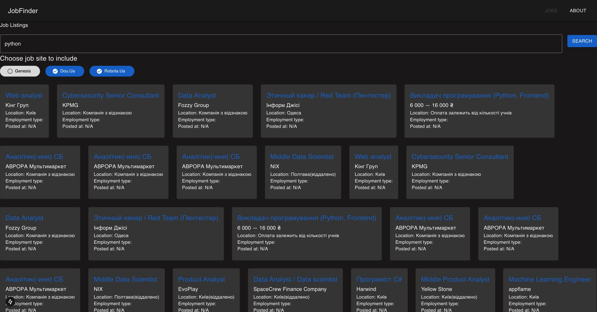

# JobHound - job scraping website

**FastAPI** based backend integrated with **SQLAlchemy**, leveraging asynchronousity for best performance.

## Features

- Asynchronous database operations: utilizes **SQLAlchemy** 2.0's async capabilities for non-blocking database
  interactions.
- **REST API CRUD** functionality: provides Create, Read, Update, and Delete operations for managing job sites.
- **Pydantic models**: incorporates pydantic for data validation and serialization.
- **Alembic** migrations: manages database schema changes using Alembic.
- **Docker** support: Offers containerization for easy deployment.

